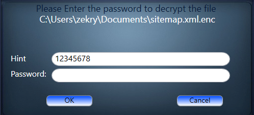

# Welcome to 
# The ENCRYPT-OR!

This is A desktop application that utilizes the <strong>WPF</strong> technology and cryptography libraries using
<strong>C# 6.0</strong>

 
The program start with a splash screen and then login screen

 

after you successfully login by entering the *username* and  *password* you will see the main window

to start encrypt the file you need to press **Select File**,  lets say you picked a file called *sitemap.xml*

 the program will reflect this change as you can see in the following picture 

 as well as the Start button will become active.

  
 
 To start encrypt the selected file you need to press the **Start** button

 this will open the Hint/Password window 
 
 

 let's say you entered 12345678 as Hint and password as Password when you press *ok* you will get this message box saying 

 encrypting *sitemap.xml* process is done successfully.

To decrypt the generated file you just pick the **sitemap.xml.enc** file and then click 

 **Start** this will trigger this window which will promote you with the entered hit for this *file* 

after you press enter the file will be decrypted and you will see msg box 

saying the file was successfully Decrypted.

Remember

The program doesn't delete the original file after encrypting it.

